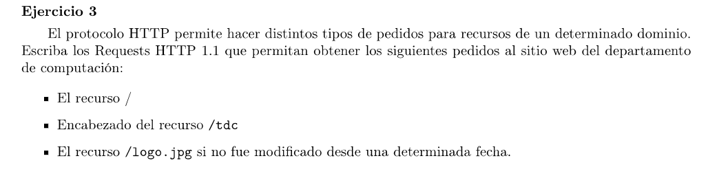

```HTTP
GET / HTTP/1.1
Host: www.dc.uba.ar
```

```HTTP
HEAD /tdc HTTP/1.1
Host: www.dc.uba.ar
```

```HTTP
GET /logo.jpg HTTP/1.1
Host: www.dc.uba.ar
If-Modified-Since: <day-name>, <day> <month> <year> <hour>:<minute>:<second> GMT
```

Poniendo en la fecha el "Last modified" del recurso en cuestión. (Este dato viene en la respuesta del servidor)