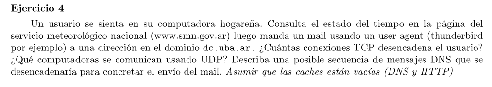

Las consultas con los name server son siempre usando UDP para mayor velocidad. Y los envios de mail siempre con TCP ya que se necesita el envio confiable (no esta bueno perder paquetes de un mail)

Tenemos una consulta usando UDP para el dominio www.smn.gov.ar que hace el usuario a su Local Name Server, que luego éste se encarga de realizar las distintas consultas a los servidores de nombre de la jerarquía para resolverlo.

Una TCP para establecer la conexión con el servidor del servicio meteorológico nacional.

Otra TCP para conectarse con el mail server que maneja la casilla del cliente. Éste luego hace una conexión UDP para resolver el dominio del mail server destino y otra TCP para enviar el mail.

Son 3 conexiones TCP.

Para resolver, por ejemplo la IP del mail server que administra dc.uba.ar se abre una conexión UDP del cliente a su Local Name Server. Éste abre una conexión UDP a algún root server que tenga la información para el dominio .ar, luego otra para el dominio uba.ar y finalmente una última para dc.uba.ar, dando un total de 5 conexiones UDP. 
El analisis es similar para el dominio del smn.

