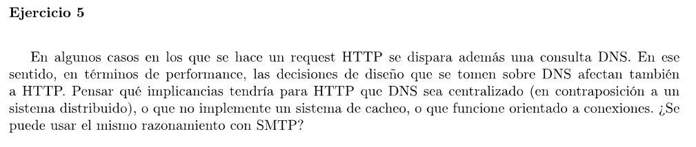

En los 3 casos se obtendría una peor performance

**DNS centralizado**: Todos los clientes compitirían para comunicarse con el servidor y se notaría un aumento en el delay para resolver los nombres de dominio.

**Sin cache**: Se perdería la eficiencia que se gana por cachear las resoluciones de nombre. Es decir, se experimentaría un mayor delay al tener que hacer más consultas a DNSs.

**Orientado a conexión**: Se agregaría el retardo de establecer la conexión (el circuito virtual). No hay un constante intercambio de mensajes que justifique establecer un enlace orientado a conexión.