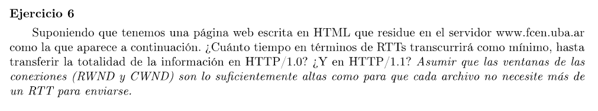
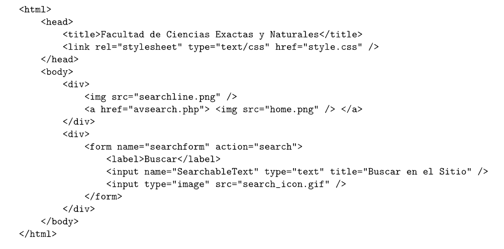

Voy a suponer que la dirección del nombre www.fcen.uba.ar ya está resuelta.

### HTTTP 1.0

En esta versión se abre una conexión TCP por cada recurso que se pide al servidor. Los archivos son: index.html, style.css, searchline.png, home.png, avsearch.php, search_icon.gif, un total de 6 documentos.      

Para cada uno se hace el siguiente intercambio de mensajes

-> [syn]
<- [syn+ack]
-> [ack] + GET *recurso* HTTP 1.0
<- [fin] < codigo de respuesta >  *respuesta*
-> [fin+ack]
<- [ack]

Esto suponiendo que el tamaño de la request y response entran en un solo paquete. Sino sería 1 RTT para establecer la conexión, N+M para enviar el request y el response y 1 RTT adicional para el cierre. Notar que el primer ACK del 3-way handshake envía parte del request y el primer FIN del 4-way handshake envía la parte final del response.

Se requieren 3 RTT por documento (suponiendo lo anterior mencionado), dando un total de 18 RTT.

https://www.w3.org/Protocols/HTTP/1.0/HTTPPerformance.html

### HTTP 1.1

Esta versión implementa conexiones persistentes. Se mantiene la conexión hasta que se termina de intercambiar los requests y responses de todos los documentos.

-> [syn]
<- [syn+ack]
-> [ack] + GET index HTTP 1.1
<- 200 OK  *index*
-> GET style.css HTTP 1.1
<- 200 OK  *style.css*
-> GET searchline.png HTTP 1.1
<- 200 OK  *searchline.png*
-> GET home.png HTTP 1.1
<- 200 OK  *home.png*
-> GET avsearch.php HTTP 1.1
<- 200 OK  *avsearch.php*
-> GET search_icon.gif HTTP 1.1
<- 200 OK  *search_icon.gif*
-> [fin]
<- [fin+ack]
-> [ack]

Nuevamente suponiendo que todas las requests y responses entran en un solo segmento, se necesitan 9 RTT.

En ambos casos también hay que suponer que los recursos se encuentran en el mismo servidor y éste no mandará ninguna respuesta de redirección.