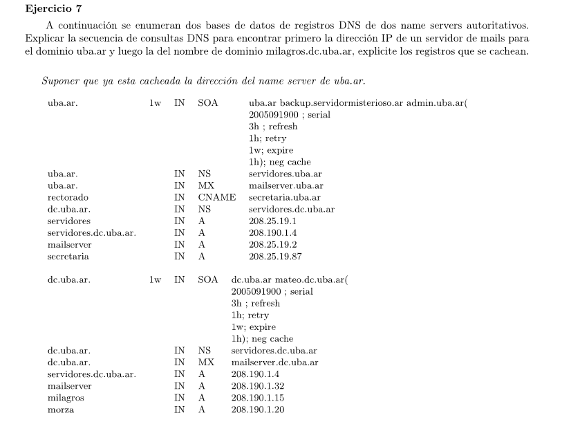

- El registro de tipo MX guarda el valor del nombre de dominio del servidor de mails.
- Los tipos A guardan IP 
- CNAME son para alias
- NS (Name Server) guarda el nombre de dominio del host que está ejecutando un servidor de nombres que administra cierto dominio. Por ejemplo el host que maneja el dominio dc.uba.ar tiene nombre de dominio servidores.dc.uba.ar e IP 208.190.1.4

###  IP del servidor de mails del dominio uba.ar

Como uba.ar ya está cacheado.

- Consulta a uba.ar por registro MX uba.ar
  - devuelve registro MX con valor mailserver.uba.ar
- Consulta a uba.ar por IP de mailserver.uba.ar
  - devuelve la IP 208.25.19.2

Se cachean ambos registros

### IP de milagros.dc.uba.ar

- Consulta a uba.ar por milagros.dc.uba.ar
  - devuelve registro NS dc.uba.ar con valor servidores.dc.uba.ar
- Consulta a uba.ar por IP de servidores.dc.uba.ar
  - devuelve IP 208.190.1.4
- Consulta a dc.uba.ar por milagros.dc.uba.ar
  - devuelve IP 208.190.1.15
  
Se cachean los 3 registros.

