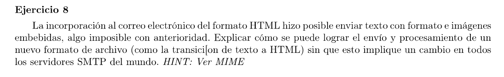

Mime es un protocolo que extiende los tipos de datos que se pueden enviar en los mails. Lo hace agregando información en los encabezados de los mensajes que luego sirven para interpretar el contenido del cuerpo del mensaje. Además, como los mails se mandan en texto ascii, define las conversiones entre los tipos de datos que agrega a ascii.

Por lo que los servidores SMTP no deben hacer ningún cambio, todos los archivos se siguen enviando en ascii y lo único que se debe modificar es la aplicación para que soporte la nueva codificación de MIME. 

```MIME
MIME-Version: 1.0
From: remitente@example.com
To: destinatario@example.com
Subject: Correo con HTML adjunto (ASCII + Base64)
Content-Type: multipart/mixed; boundary="boundary123"

--boundary123
Content-Type: text/plain; charset="US-ASCII"
Content-Transfer-Encoding: 7bit

Este es un correo con un archivo HTML adjunto.

--boundary123
Content-Type: text/html; name="archivo.html"
Content-Disposition: attachment; filename="archivo.html"
Content-Transfer-Encoding: base64

PGh0bWw+CjxoZWFkPgo8dGl0bGU+QXJjaGl2byBIVE1MIGVuIEFTQ0lJPC90aXRsZT4KPC9oZWFk
Pgo8Ym9keT4KPHA+SG9sYSwgZXN0ZSBzIHVuIGFyY2hpdm8gSFRNTCBzaW4gY2FyYWN0ZXJlcyBl
c3BlY2lhbGVzLjwvcD4KPC9ib2R5Pgo8L2h0bWw+Cg==

--boundary123--
```