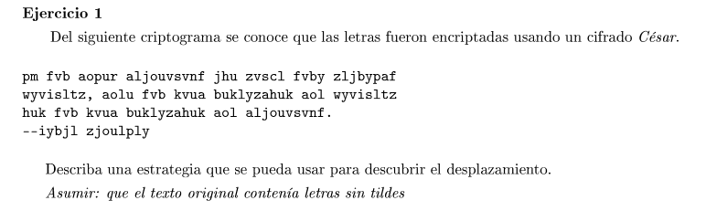

El cifrado Cesar consiste en rotar el alfabeto en una cantidad fija de letras. Podemos proabr todas las rotaciones posibles hasta obtener palabras del diccionario del idioma del mensaje. (fuerza bruta)