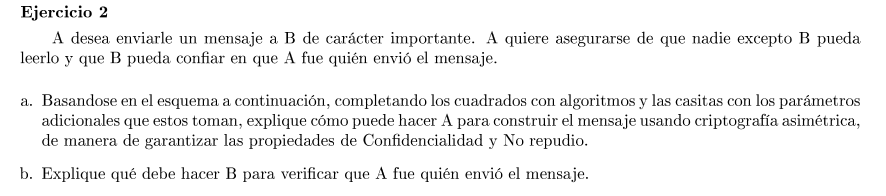
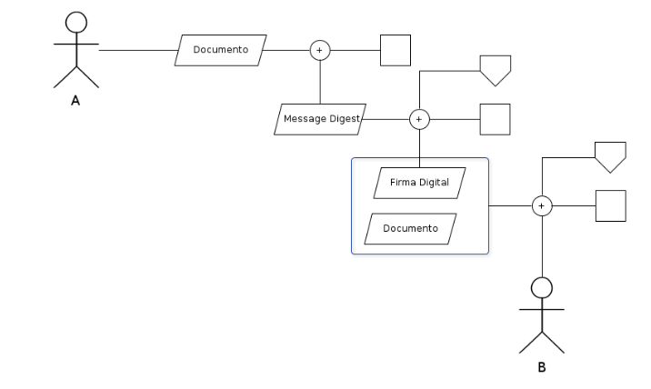
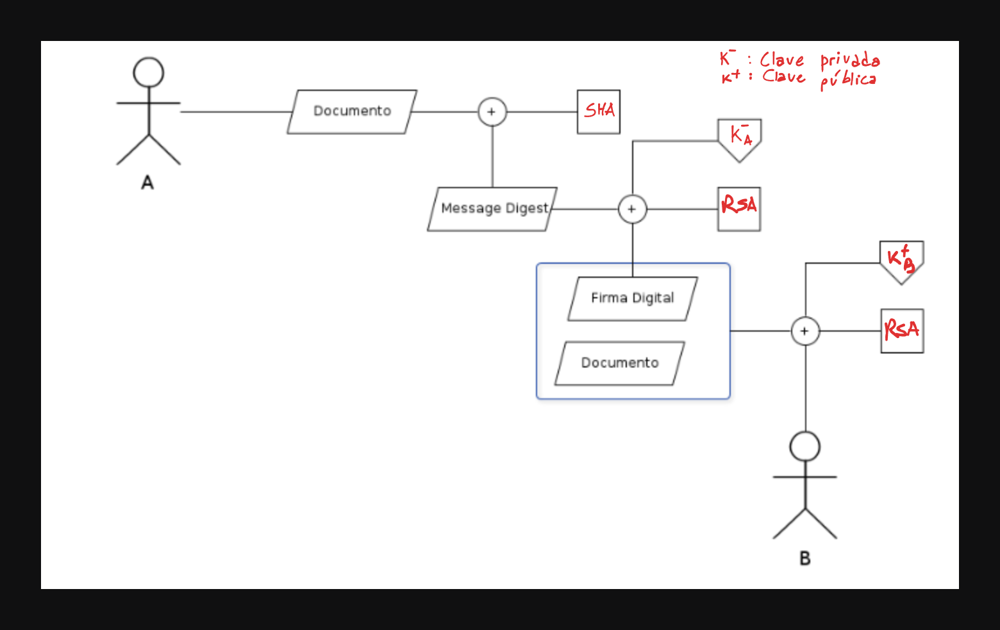

### a

En el primer paso se usa SHA para generar el hash del mensaje. Luego con la clave privada de A y el message digest se firma digitalmente el documento. Finalmente se encripta lo obtenido con la clave pública de B para confidencialidad.

### b

B desencripta el mensaje con su clave privada obteniendo la firma digital y el documento. Luego toma la firma digital y la desencripta con la clave pública de A, obteniendo el hash del documento calculado por A. Finalmente calcula el hash del docuemnto usando el mismo algoritmo que usó A y el resultado lo compara con el hash que le llegó de A. Si coinciden B tiene la certeza de que la fuente del mensaje fue A y además que no fue modificado.