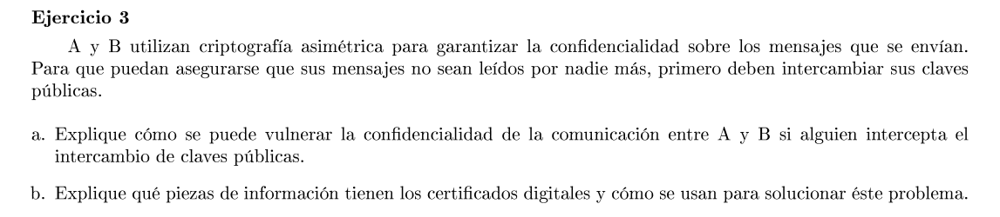

### a

Un tercero puede interceptar el intercambio, guardarse las claves públcas de ambos y darles la propia a ambos. Luego cuando, por ejemplo, A manda un mensaje lo hace con la clave pública del intermediario, éste lo desencripta, lee el contenido, lo encripta con la clave de B y se lo envía. Lo mismo si B es el que envía el mensaje. De esta forma ninguno se entera que hay un tercero de por medio.

### b

Un certificado digital tiene al menos:
- La identidad de la entidad siendo certificada
- Su clave pública
- La identidad del certificador
- La firma digital para el certificado, emitida por el certificador
- (opcional) tiempo de expiración

Un certificado digital proporciona garantías sobre quien es el dueño de la clave pública. 
Un CA (Certification Authority) es el que entrega los certificados.

Una entidad va con su identificación y su clave pública y el CA le otorga un certificado digital. El CA toma la clave pública, su identificación y demás datos y la hashea usando su clave privada (genera una firma digital). El certificado consiste en la clave pública, la firma generada y algunos otros parámetros (mencionados antes). 

Luego cualquier persona que confie en el CA puede corroborar la autenticidad de una clave pública: 

- Desencripta con la clave pública del CA la firma digital emitida por el CA para obtener el hash del certificado
- Calcula el mismo hash que el CA a partir de los datos del certificado 
- Compara ambos resultados. Si coinciden entonces es seguro afirmar que el certificado fue emitido por el CA (que fue el encargado de validar la identidad del dueño de la clave).

Ahora el problema del punto A se soluciona con estos certificados. A y B intercambian sus certificados y usan esas claves para la comunicación. Un tercero (C) no puede entregar su clave pública haciendose pasar por A o B ya que si consigue un certificado por la misma CA, va a tener su identificación y no la de A o B. Además C no puede modificar el certificado ya que luego el hash no coincidiría.
