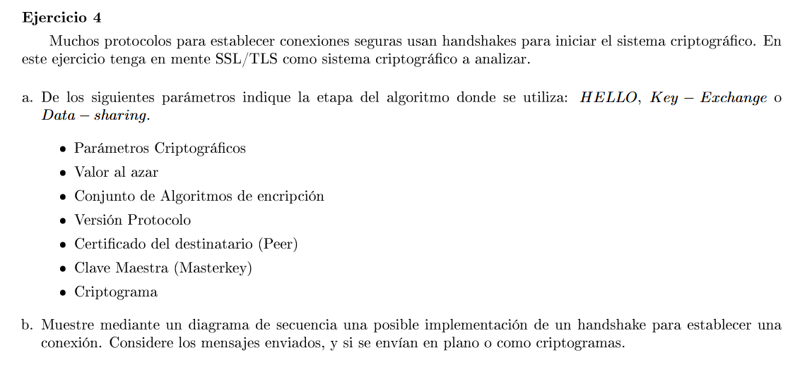
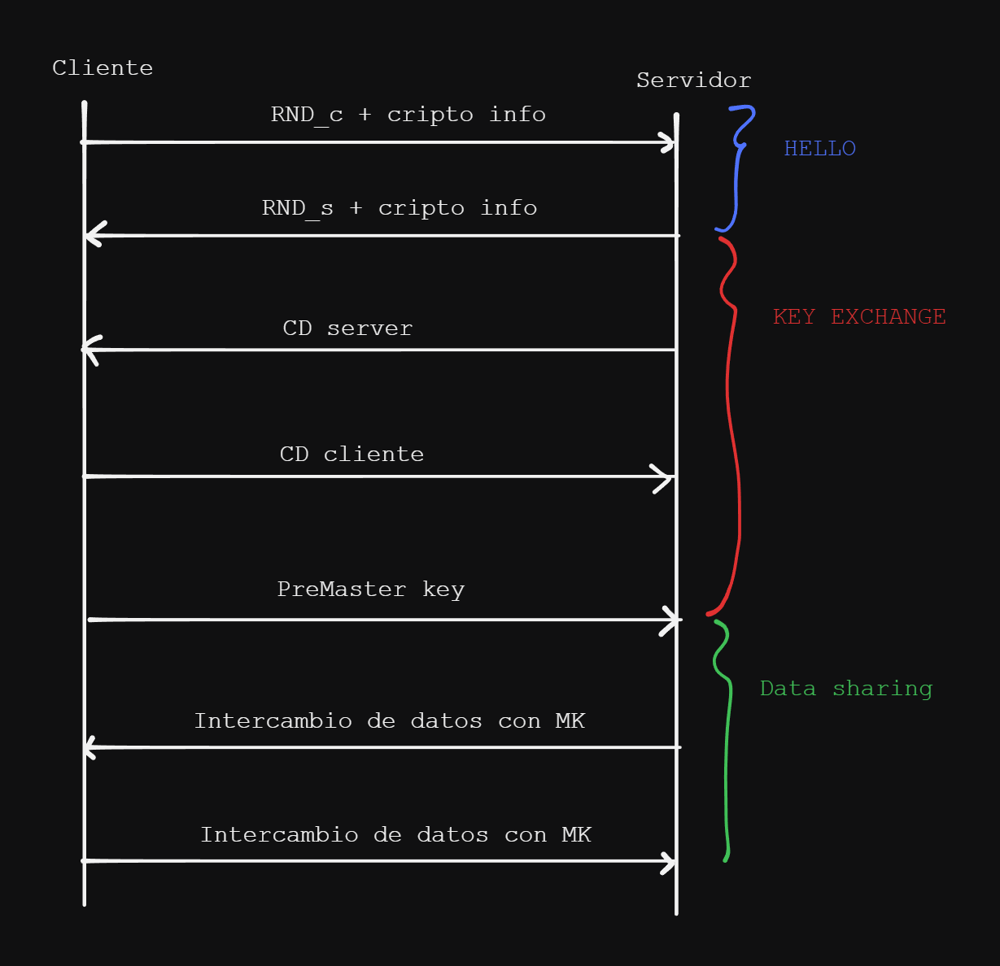

### a
| HELLO                                  | Key-exchange             | Data sharing |
|----------------------------------------|--------------------------|--------------|
| Conjunto de algoritmos de encriptación | Certificado destinatario | Master key   |
| Versión del protocolo                  |                          | Criptograma  |
| Valor al azar                          |                          |              |

### b

La Master Key se calcula con los valores random enviados en la etapa de HELLO y con la pre-master-key generada por el cliente y enviada al servidor. Ambos la calculan y cambian la comunicación a una encriptada con dicha clave.