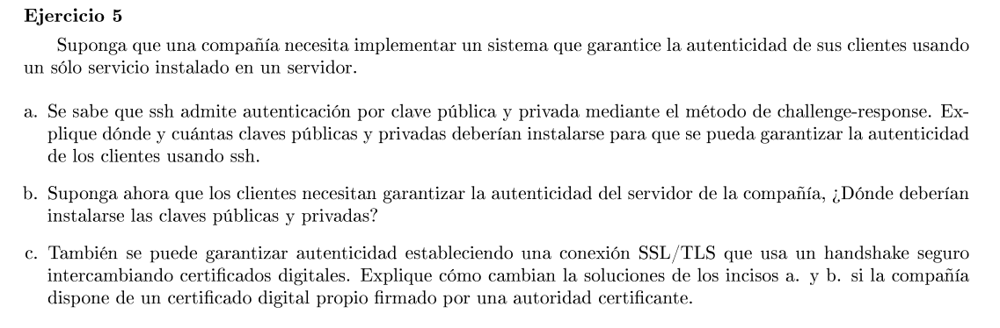

### a

Se quiere autenticar a los clientes. Se necesita una clave pública y una privada por cada cliente. El servidor debe guardar la clave pública de todos los clientes.

Cuando se requiera autenticar a un cliente, el servidor envía un número aleatorio al cliente (challenge). El cliente lo encripta con su clave privada y se lo envía al servidor (response). El servidor lo desencripta con la clave pública del cliente y corrobora que sea el mismo número generado. Así queda autenticado la identidad del cliente.

### b

El server necesita un par de clave pública y privada. Todos los clientes deben guardar la clave pública del servidor para hacer el mismo proceso de challenge-response.

### c

Para el inciso a no cambia ya que el certificado del server solo sirve para autenticarlo a él y no a los clientes.

Para el inciso b, los clientes pueden usar este certificado para autenticar al servidor. Por lo que con recibir su certificado bastaría y no haría falta usar el protocolo de challenge-response.
El cliente toma el certificado y usa la clave pública de la CA que emitió el certificado para corroborar los datos del certificado y la identidad del servidor.