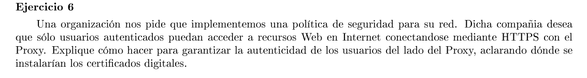

Se necesita autenticar a los clientes. Por lo que cada cliente autorizado debe tener un certificado digital. 
Una opción es tener certificados digitales internos. El proxy tendría su propio certificado firmado por él mismo, y luego genera los certificados para los usuarios autorizados.

El certificado autofirmado del proxy debe instalarse en los clientes para que estos confien en él.

Cuando el proxy quiera autenticar a un cliente, le pide el CD y corrobora con su propia clave pública la autenticidad del certificado.

