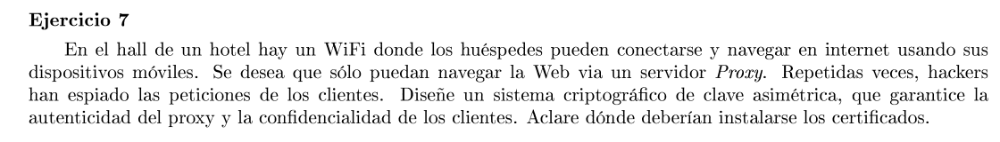

Se necesita un certificado digital para el proxy. Un cliente cuando se conecte a la red se le hace conocer dicho certificado.
Luego usando TSL (omitiendo la autenticación del cliente) podemos garantizar la autenticidad del proxy y la confidencialidad de la comunicación.