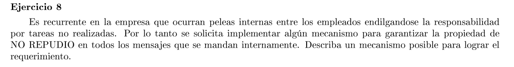

Cada mensaje que se mande debe estar firmado digitalmente, de esta forma se garantiza el no repudio.
Para poder generar las firmas los empleados deben tener una clave pública y privida. Por lo que se debe tener una autoridad central que certifique las claves públicas de cada empleado.