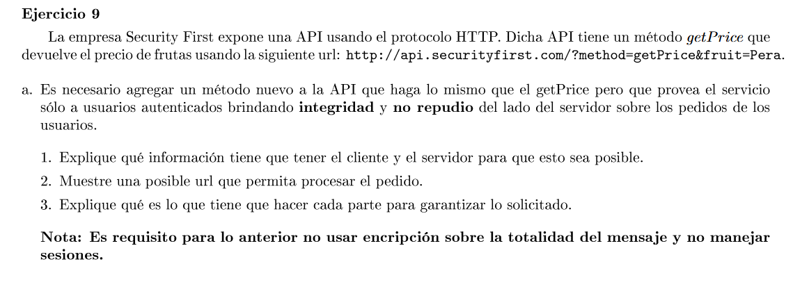

Los clientes autorizados a usar el nuevo método deben tener una clave pública certificada y una clave privada.
Cada mensaje correspondiente al nuevo método se hashea y se encripta con la clave privada del cliente. Es decir, se firma digitalmente. Se envía al servidor la petición y la firma.

El servidor debe tener las claves públicas de los clientes que esten autorizados a usar el nuevo método de la API. Cuando le llega una petición de dicho método hace lo siguiente para corroborar la identidad del cliente y la integridad del mensaje:
- Usa la clave pública del cliente para desencriptar el hash
- calcula el hash del mensaje
- Compara el hash calculado con el desencriptado. Si coinciden entonces la petición fue enviada por el cliente y además no fue modificada por un tercero.